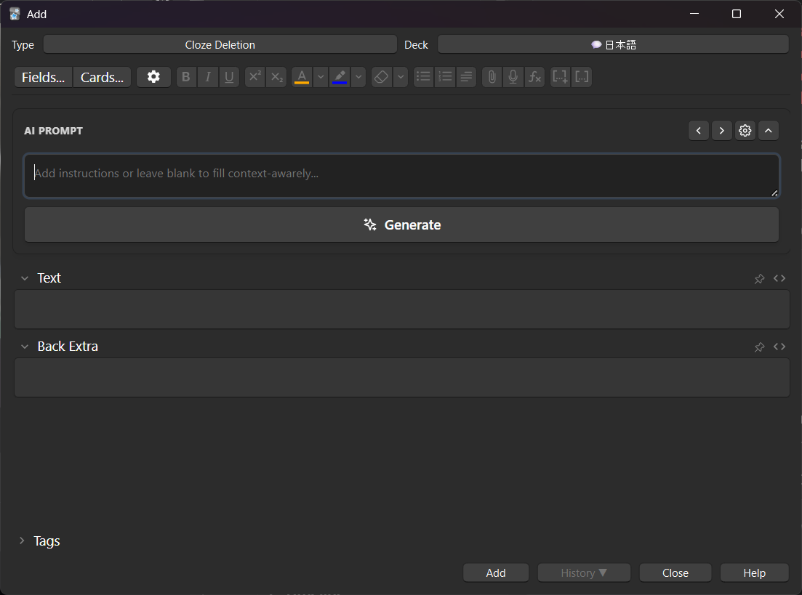
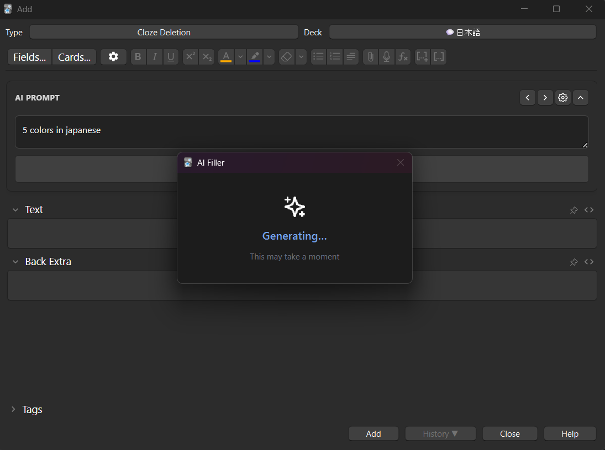
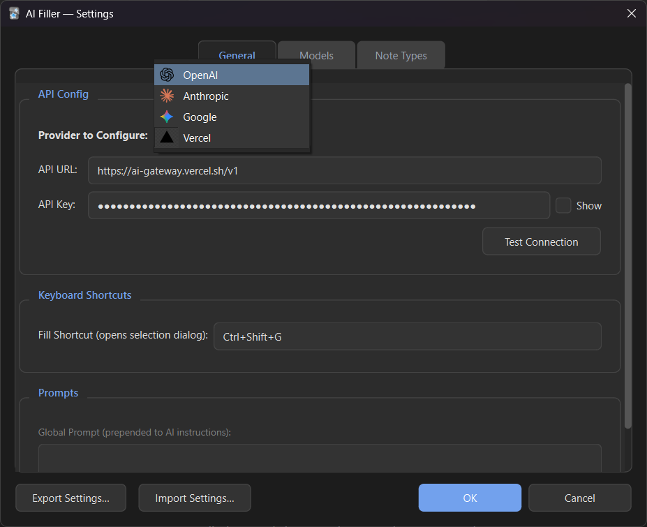
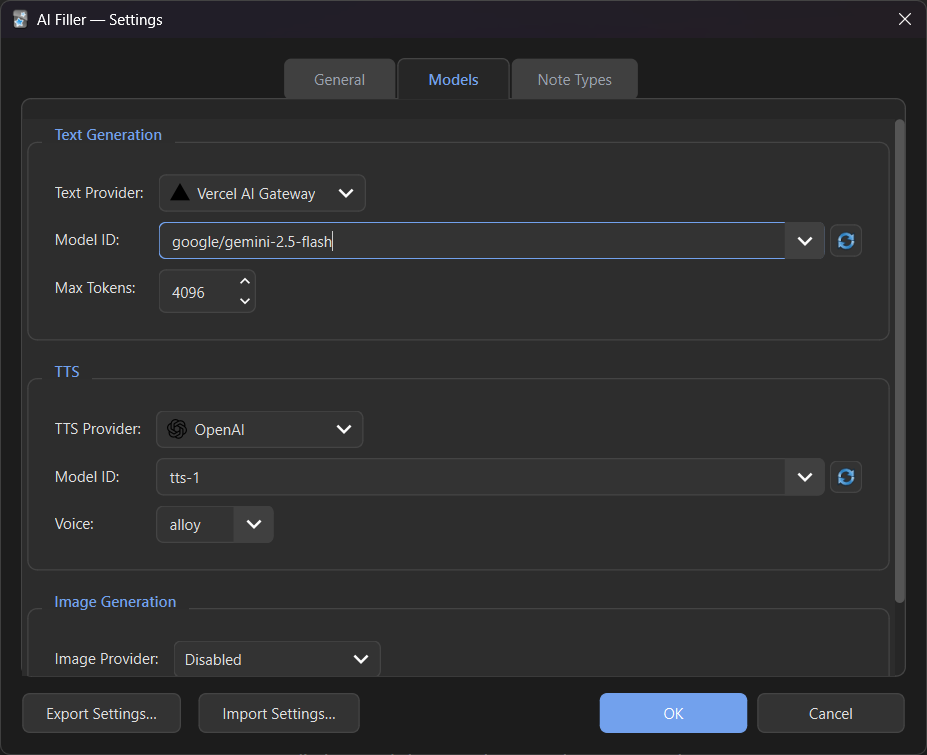

# Anki AI Filler

An intelligent, multi-provider assistant for Anki that uses Large Language Models (LLMs) to automatically populate your flashcards with text, high-quality Text-to-Speech (TTS), and AI-generated images.

> [!NOTE]
> This is a fork of the original [talafek96/anki-ai-field-filler](https://github.com/talafek96/anki-ai-field-filler).

## ✨ Key Features

- **Multi-Provider Support**: Connect directly to OpenAI (GPT-4o), Anthropic (Claude 3.5), and Google (Gemini 1.5). No middleman, just use your own API keys.
- **Auto-Fill Everything**: Intelligently populates blank fields based on your note content and per-field instructions.
- **Native TTS & Images**: Generate audio and illustrations directly within Anki, saved automatically to your media folder.
- **Batch Processing**: Process hundreds of cards at once with a side-by-side review/edit interface.
- **Persistent UI**: Use the integrated AI Prompt bar directly in the editor (supports collapse/expand states).

## 🚀 Quick Start

1. **Configure API**: Go to **Tools → AI Filler → Settings** and enter your API key for OpenAI, Anthropic, or Google.
2. **Set Instructions**: In the **Note Types** tab, describe what each field should contain (e.g., *"Provide a simple Japanese sentence using the word in the Front field"*).
3. **Fill Cards**:
   - **Single Note**: Use the **AI Prompt** bar in the editor or press `Ctrl+Shift+G`.
   - **Batch**: Select cards in the Browser → Right-click → **AI: Batch fill blank fields...**

## 🛠 How It Works

1. **Context Gathering**: The addon reads your current field values and your custom instructions.
2. **AI Action**: The LLM determines the best content type (text, audio, or image) for each target field.
3. **Content Generation**:
   - **Text**: Standard HTML or plain text.
   - **Audio**: Text is sent to a TTS provider and saved as a sound file.
   - **Images**: A prompt is sent to an image generator and saved as a PNG/JPG.
4. **Review (Batch only)**: For bulk operations, you can review and edit every AI proposal before applying it to your collection.

---

## ⚙️ Configuration

Choose different providers for text, TTS, and images. Refresh model lists directly from the provider APIs to use the latest capabilities.

  
  

---
